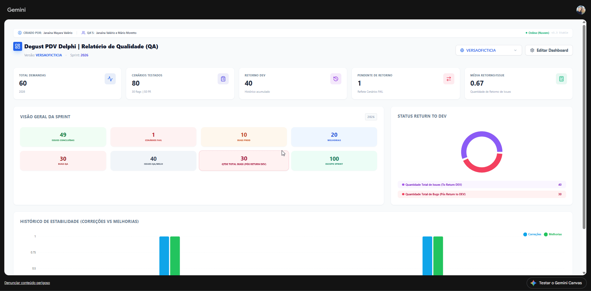

# Dashboard de Gestão de Qualidade - Degust PDV Delphi

Um dashboard moderno e em tempo real para gestão de qualidade do **Degust PDV Delphi**, desenvolvido para transformar métricas brutas em decisões estratégicas.

Esse Dashboard é uma ferramenta **Serverless e Reativa** 📊

## ✨ O que este projeto resolve

- **Visibilidade em Tempo Real** — Adeus planilhas estáticas!
- **Gestão de Retorno (To Return DEV)** — Monitoramento preciso de issues que voltam para desenvolvimento
- **Consolidação de Dados** — Métricas por versão ou consolidadas
- **Colaboração** — Toda a equipe edita e visualiza os dados simultaneamente via Firebase
- **Destaque** - O QA que 

## 🛠️ Tecnologias

- **Frontend**: React.js + Vite
- **Estilização**: Tailwind CSS
- **Banco de Dados**: Firebase Firestore (Realtime)
- **Gráficos**: Recharts
- **Deploy**: (Firebase Hosting / Vercel / Netlify)

## 🌐 Modelo de Implantação e Acesso

Diferente de aplicações tradicionais que exigem instalação local, este Dashboard foi concebido como uma **Solução Reativa via Nuvem**. 

- **Plataforma de Execução:** O dashboard opera diretamente sobre uma infraestrutura de IA Generativa (Gemini), funcionando como um "Live Artifact".
- **Persistência:** Todos os dados são sincronizados em tempo real com o **Firebase Firestore**, garantindo que, mesmo sendo acessado via link dinâmico, as informações de QA sejam mantidas e compartilhadas entre a equipe.
- **Acesso:** O acesso é realizado através de um link de visualização reativo, eliminando a necessidade de configuração de ambientes locais (Node.js, Webpack, etc.) para os usuários finais (QA's e Gestores).

## ⚙️ Como Replicar este Projeto

O código-fonte (`dashboard_qa.tsx`) contido neste repositório pode ser:

1. Inserido em um ambiente que suporte **React + Tailwind** (como Vite ou Create React App).
2. Utilizado como um script em plataformas de IA com suporte a artefatos dinâmicos.
3. Configurado para apontar para sua própria instância do Firebase.

## 💡 Funcionalidades Principais

* ✅ Cadastro e monitoramento de versões
* ✅ Acompanhamento de issues "To Return DEV"
* ✅ Gráficos de estabilidade por versão
* ✅ Filtros e consolidação de métricas
* ✅ Atualização em tempo real (Firebase)
* ✅ As apresentações Review jamais serão as mesmas com esse Dashboard 🛫
* ✅ Confiabilidade na Equipe de QA

## 💡Informação Importante 🧩

Este dashboard foi projetado sob o conceito de **Zero Infrastructure**. Ele utiliza a capacidade de processamento de IA para renderizar a interface (React) em tempo real, enquanto o **Firebase** cuida da camada de dados na nuvem. Isso permite que a equipe de QA acesse o relatório atualizado de qualquer lugar, via link, sem precisar de deploys complexos ou servidores dedicados.

## 🎲 Dashboard em Execução com Dados Fictícios

## 🔗 Link do Dashboard em Produção
[Ver Dashboard ao Vivo](https://gemini.google.com/share/c47be9ad5208)

[1ª versão do Dashboard](https://gemini.google.com/share/1e3897c9541f)

[Versão que contém dados separados por versões](https://gemini.google.com/share/ee3bbd85bff4)

## 👤 Autora
Desenvolvido por Janaína com muito carinho e ❤️

- E-mail: jm.janainamayara@hotmail.com
- GitHub: [@janaina-valerio](https://github.com/janaina-valerio)

  
⭐ **Deixe uma estrela se este projeto te ajudou! 💜**
